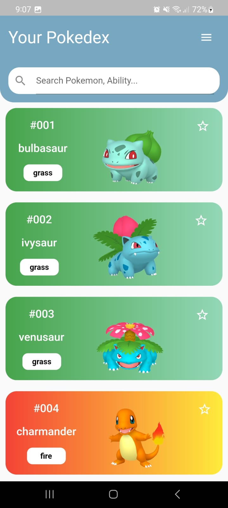
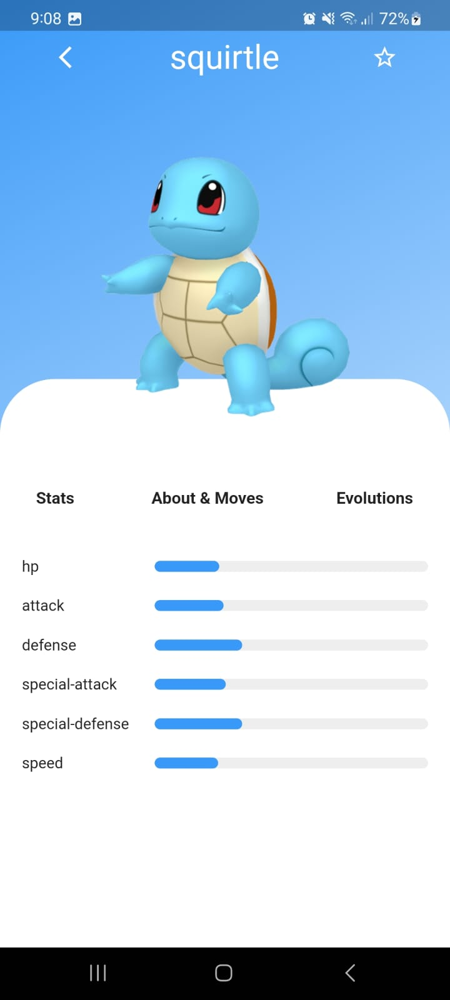
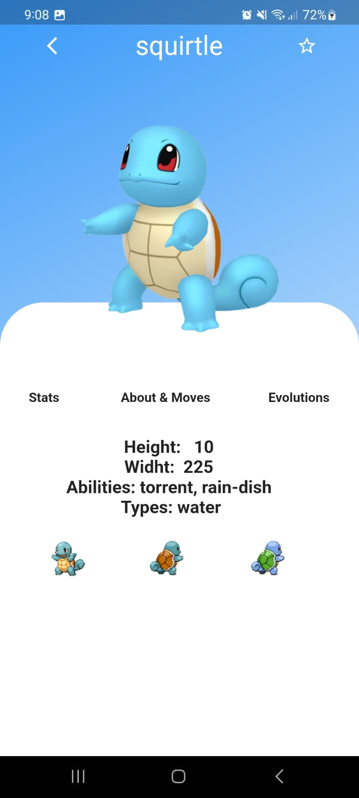

# Pokedex App

This project shows how to implement API in Flutter.
I'm using http 0.13.5 and provider 6.0.5

# Runing the project

1. Clone the repository

2. Open the project in your preferred IDE

3. Run the app on an emulator or physical device.

